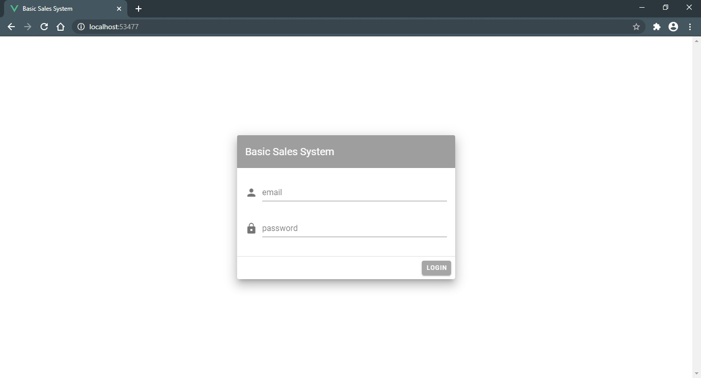
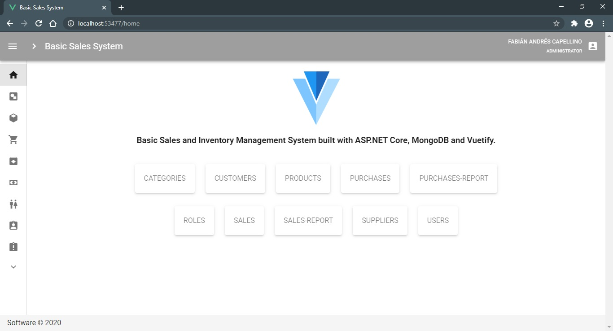
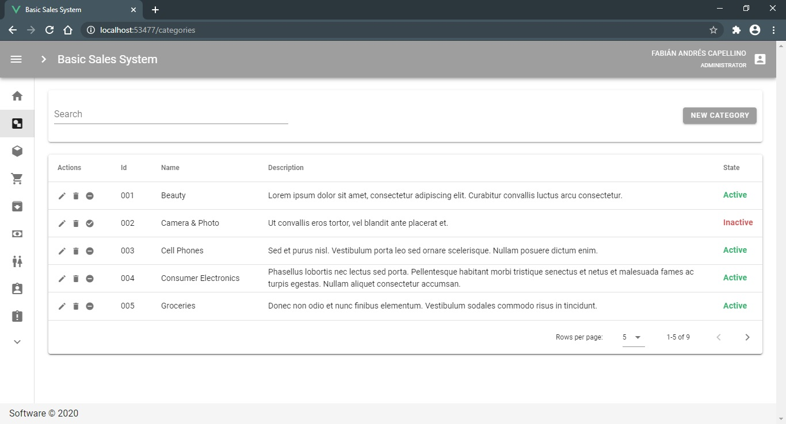
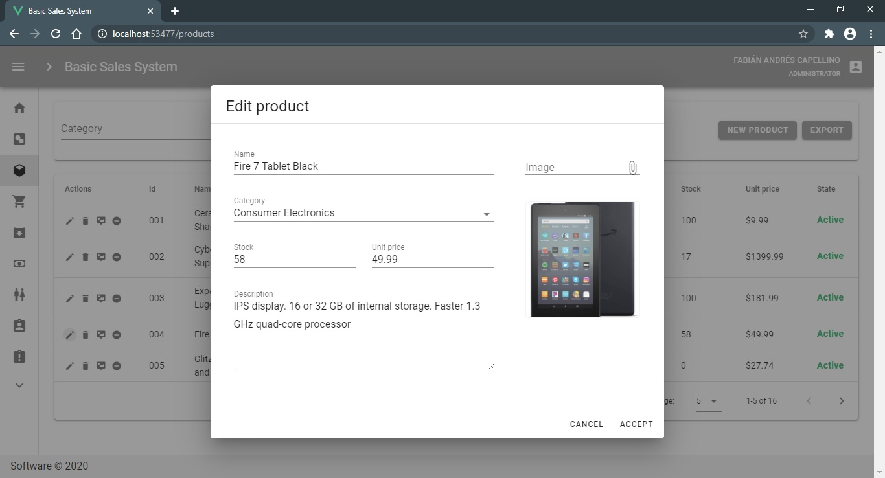
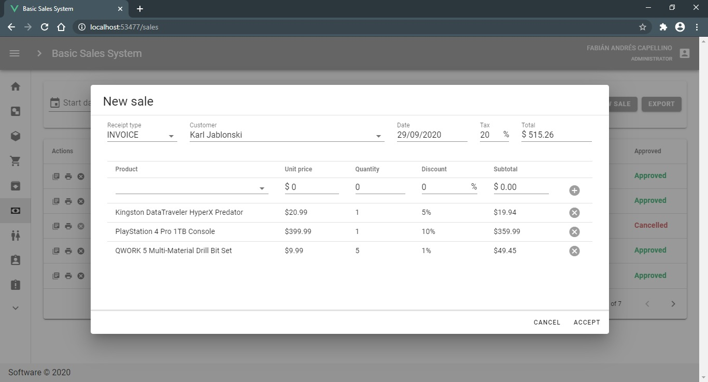
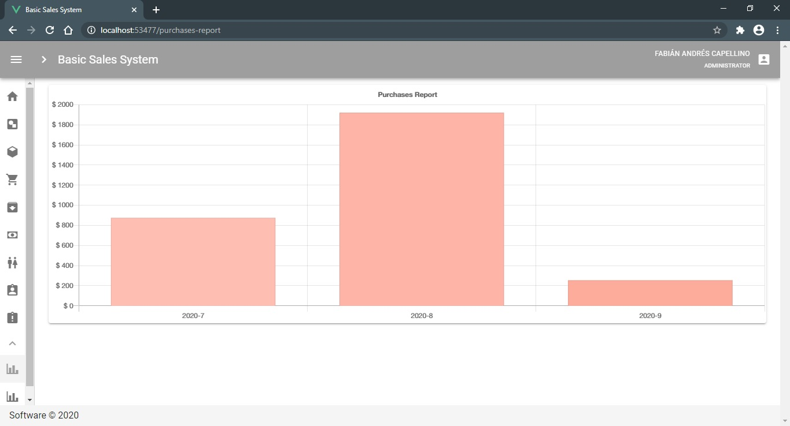

# Basic Sales System with ASP.NET Core and MongoDB

Basic sales and inventory management system built with ASP.NET Core, MongoDB and Vuetify.

## Technologies
- ASP.NET Core 3.1
- ASP.NET Core Identity.Mongo
- FluentValidation
- MongoDB
- Swagger
- TypeScript
- Vuetify.js Material Design Component Framework
- V-Snackbars
- Vuex
- Browser-image-compression
- Chart.js
- JsPDF
- Lodash.js
- SheetJS

## Features
- Global error-handling middleware.
- MongoDB Transactions.
- Refresh Tokens.
- Role-based authorization.
- Statistical charts.
- XLSX and PDF reports.

## Screenshots

## Resources

- *[Introduction to ASP.NET Core](https://docs.microsoft.com/en-us/aspnet/core/introduction-to-aspnet-core?view=aspnetcore-3.1)*
- *[Create a web API with ASP.NET Core and MongoDB](https://docs.microsoft.com/en-us/aspnet/core/tutorials/first-mongo-app?view=aspnetcore-3.1&tabs=visual-studio)*
- *[Building an app with .Net Core and Vue](https://www.udemy.com/course/desarrolla-sistemas-web-asp-net-core-sql-server-vuejs-vuetify/)*
- *[Vuetify](https://vuetifyjs.com/en/getting-started/quick-start/)*
